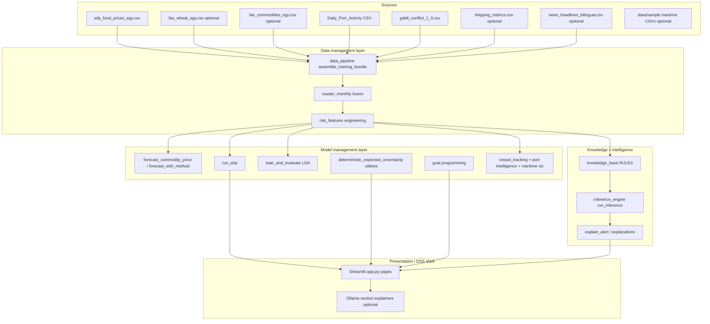

# Egypt Food Import Intelligence DSS — Full Project Description

This document is a **standalone, detailed** reference for academics, supervisors, or technical stakeholders. It complements `README.md` (run instructions and file list), `PROJECT_REPORT.md` (condensed methodology and diagrams), and the source code itself. **Navigation presently exposes twelve Streamlit routes** (`PAGES` in `app.py`); retired screens are summarized under **Historical context** in §5.

---

## 1. Business context and problem statement

### 1.1 Domain

Importers of **staple foods** (especially **wheat and wheat-derived products**) to **Egypt** operate under:

- **Price volatility** driven by currency, global cereals markets, subsidies, and local retail dynamics.
- **Geopolitical and conflict exposure** in supplier regions (e.g. Black Sea corridors, regional instability cues).
- **Logistics friction** reflected in shipping stress, congestion, and port throughput proxies.
- **Information overload** across prices, maritime flows, structured conflict statistics, and **Arabic–English** news text.

Decision makers need repeatable ways to **integrate heterogeneous signals**, **express risk as a coherent score**, **compare strategies under different decision-theoretic assumptions**, and **explain** suggested actions—not only to comply with coursework on **Decision Support Systems (DSS)** and **Intelligent Decision Support Systems (IDSS)**, but to mirror realistic ministry or corporate “fusion” dashboards.

### 1.2 What this prototype delivers (business outcomes)

| Outcome | How the app supports it |
|--------|-------------------------|
| **Single-pane situational awareness** | Executive KPIs, gauge, maritime snapshot, inference recommendation. |
| **Price-track intelligence** | Multi-commodity WFP curves, selectable forecast algorithms, residuals. |
| **Corridor logistics view** | Port activity by cargo segment and country (ISO3). |
| **Geopolitical trajectory** | GDELT-style conflict intensity by country/year. |
| **Cross-domain analytics** | Multi-commodity **WFP×FAO** blends when **`fao_commodities_egy.csv`** (or wheat-only **`fao_wheat_egy.csv`**) is present; shipping layers; NLP conflict vs volatility. |
| **Composite risk tuning** | AHP-derived weights + sensitivity sliders and tornado plots. |
| **Explicit decision theory** | Certainty / expected utility / uncertainty criteria (+ scenario stocking). |
| **Normative sourcing strategy** | Goal programming over competing procurement strategies. |
| **Governance transparency** | Tabular rule base linking conditions to actions and data sources. |

The system is framed as **educational and demonstrative**: **LDA** still runs **in session** for the Executive KPI chip (weak/rule-based labels from engineered features)—there is **no standalone Discriminant page**. Maritime data can be synthetic; correlations are illustrative until real corpora and APIs replace demo inputs.

---

## 2. DSS vs IDSS vocabulary (technology mapping)

### 2.1 Decision Support System (DSS)

A **DSS** historically combines **data**, **models**, and **presentation** so managers can semi-structure decisions. Typical components:

- **Data subsystem** — acquisition, cleansing, aggregation (monthly masters, KPIs).
- **Model subsystem** — forecasting, optimization, simulations, multicriteria methods.
- **Dialog / UI** — interactive exploration, parameterized views (Streamlit widgets).
- Optionally **knowledge** stored as procedural rules rather than opaque ML only.

### 2.2 Intelligent DSS (IDSS)

An **IDSS** extends DSS with mechanisms that emulate **intellectual phases** of problem solving:

- **Knowledge representation** — explicit IF–THEN rules with IDs and citations (`knowledge_base.py`).
- **Inference** — chaining conditions over current context (`inference_engine.py`).
- **Explanation** — “why” narratives for alerts (`explanation_engine.py`, recommendation cards).
- **Optional generative adjunct** — Ollama-based section explainers and routing advice (`ollama_explain.py`, sidebar), when a local LLM is available.

Together, **`app.py`** + **`src/*`** instantiate a textbook IDSS layering: **data management → models → KB → inference → explanation → UI → decision maker.**

---

## 3. Architecture (technical overview)

### 3.1 Runtime and dependencies

| Layer | Technology |
|-------|-------------|
| **UI / orchestration** | Streamlit (`app.py`): stacked **sidebar buttons** (`render_sidebar_page_nav`), light **page header card** (**title only** via `render_header`), global polish (`inject_custom_css` in `ui_components.py`). |
| **Data engineering** | Pandas / NumPy, chunked CSV reads for large port files (`data_pipeline.py`). |
| **Visualization** | Plotly Graph Objects + shared DSS layout helpers (`chart_theme.py`, `apply_dss_*`). |
| **Forecasting** | Naive/SMA/WMA/exp. smoothing (`decision_methods.py`, `statsmodels` when applicable). |
| **Multicriteria weights** | AHP eigenvector / consistency ratio (`ahp.py`). |
| **Multigoal discrete choice** | Weighted deviations goal programming (`goal_programming.py`). |
| **Classification** | scikit-learn **Linear Discriminant Analysis** on engineered features (`discriminant_analysis.py`). |
| **Rule firing** | Python predicates over normalized context (`inference_engine.py`). |
| **HTTP (optional)** | `requests` for Ollama; optional **`SHIPPING_TRACKER_API_URL`**. |
| **Caching** | `@st.cache_data`: `cached_bundle(_bundle_schema=…)` bumps the cache key when the bundle dataclass changes; separate cache for raw WFP-per-commodity catalog (`app.py`). Clear via Streamlit menu (**Settings → Clear cache**) or restarting the session. |

### 3.2 Logical architecture

### 3.3 Data spine (conceptual)

1. **`assemble_training_bundle()`** resolves paths relative to **project root** (`project_root()` in `utils`) and reads each CSV where present (see §4). It attaches **`TrainingDataBundle.fao_catalog`**: monthly series keyed by FAOSTAT **Item** (or curated simple-multi file) when **`fao_commodities_egy.csv`** is present.
2. **Wheat (and blend)** feed the pipeline **risk spine**. Primary FAO wheat input remains **`fao_wheat_egy.csv`**. If that file is missing but **`fao_commodities_egy.csv`** contains a wheat-like Item row, **`find_best_fao_series`** resolves that Item for blending into **`wheat_prices`** alongside WFP (`merge_wfp_fao`).
3. **`build_blended_wfp_commodity_catalog`** (called from **`app.py`** commodity pages): for **each** distinct WFP retail label, merges with the best-keyed FAO dataframe from **`fao_catalog`** (thresholded name match via **`fao_catalog_match_score` / `find_best_fao_series`**). Any WFP commodity whose label contains **`wheat`** uses **`bundle.wheat_prices`** so UI stays aligned with the engineered risk pipeline.
4. **Ports** aggregated to Egypt-focused monthly calls/imports/exports (`load_ports_monthly`, optional cargo-wide table for dashboards).
5. **GDELT** narrowed to focal country codes aligned with Egypt corridors.
6. **Shipping tracker** merges with **port-derived stress** (`merge_shipping_layers`).
7. **News pipeline** produces **monthly** `nlp_conflict_index`, `news_sentiment_avg`; may **synthesize** headlines if corpus missing (`build_news_pipeline`).
8. **`build_master_monthly`** joins layers on **`month`** (using the **wheat** USD spine—not every per-commodity blend).
9. **`build_risk_features`** derives **scores** consumed by unified risk, inference, LDA (**Executive KPI only**), and visuals.

Unified risk formula (high level):

- Context row from **latest** `risk_features` augmented with heuristic proxies (`_last_features` in `app.py`).
- **`unified_risk(ahp_weights, row)`**: weighted sum over **six AHP criteria** (with stock and “alternative readiness” inverted so higher = worse contribution where intended).
- Clamp to **[0, 100]** for gauge bands and dashboards.

---

## 4. Data catalog (inputs, roles, approximate schema)

Paths default to **repository root**. Optional files degrade gracefully unless a page strictly requires prices.

| File | Approximate role | Key fields / semantics |
|------|------------------|------------------------|
| **`wfp_food_prices_egy.csv`** | Core retail prices Egypt; forecasting + commodity explorer (all distinct commodities parsed). | `date`, `commodity`, `price`, `usdprice`, optionally `market` (National preferred). |
| **`fao_wheat_egy.csv`** | Optional wheat-only FAO/FAOSTAT (or simple `month`,`price_usd`) series; blends into **`wheat_prices`** with WFP (**55%/45%** when overlaps exist via `merge_wfp_fao` in `fao_prices.py`). | Flexible schema—see loaders in **`fao_prices.py`**. |
| **`fao_commodities_egy.csv`** | Optional **multi-Item** FAOSTAT export filtered to Egypt: one USD monthly series **per distinct Item**. Drives **`fao_catalog`** in the bundle; UI commodity pages overlay FAO vs WFP for **all** mapped retail labels; wheat Item can backstop the spine if **`fao_wheat_egy.csv`** is absent. | FAOSTAT long: **`Area`,`Item`,`Value`,`Year`** (+ optional month column); see `load_fao_commodities_catalog`. |
| **`Daily_Port_Activity_Data_and_Trade_Estimates.csv`** | Logistics stress; EG and corridor ISO3 aggregates; optionally cargo-segment columns. | Daily/wide UNCTAD-style fields → monthly `port_monthly`; segment columns named like `portcalls_dry_bulk`, `import_*`, `export_*`. |
| **`gdelt_conflict_1_0.csv`** | Annual conflict/event intensity proxies by country code. | `CountryCode`, `year`, conflict-related metric → `conflict_intensity`. |
| **`shipping_metrics.csv`** | Optional KPIs merged with port-derived lane stress. | Time index + congestion/delay-style columns (normalized in `shipping_tracker`). |
| **`news_headlines_bilingual.csv`** | NLP inputs; bilingual conflict lexicon density + sentiment aggregates. | `published_at`, `text`, `language` (`ar` / `en`). If absent, volatility-linked **synthetic** headlines flagged in UI. |
| **`data/sample/demo_*.csv`** | Offline maritime demo (**ports**, **vessels**, **zones**, **routes**) for Plotly Scattergeo dashboards. | Read by maritime modules; regenerated from defaults if missing. |

**Environment:** `SHIPPING_TRACKER_API_URL` → JSON ingestion path in shipping module (vendor-specific); `OLLAMA_BASE_URL` / `OLLAMA_MODEL` via sidebar overrides.

---

## 5. Page-by-page descriptions (business need + technical detail)

Sidebar order mirrors **`PAGES`** in **`app.py`** (each route is a full-width **`st.button`** with primary/secondary styling in `render_sidebar_page_nav`; active page uses session key **`dss_nav_page`**). If a stale session navigates to a removed label, **`main()`** resets to **`PAGES[0]`**.

### 5.1 Executive Overview

**Business need.** Give leadership a **risk pulse**: composite score trend context, discriminative classifier readout, top driver banner, maritime awareness, optional rule-based takeaway.

**Technical content.**

- **`render_header`** (per page): shared **title strip**—**title string only** (no subtitle paragraph; `ui_components.render_header` drops the optional second argument).
- Four **KPI cards**: unified risk, forecast trend keyword, LDA class, AHP consistency ratio CR.
- **Risk band badge** mapped from thresholds on unified score (Low / Moderate / High / Critical).
- **`build_maritime_snapshot`** → **`render_executive_maritime_summary`**: KPI strip, Scattergeo-lite intelligence, correlations with DSS features where implemented in `ui_maritime_dashboard.py`.
- **`run_inference(context)`** — if alerts fire, **primary recommendation card** uses **`explain_alert`**.
- Plotly **gauge** (final risk score) plus **horizontal bar** of geopolitical vs logistics vs price stress (multi-select).
- **Ollama** expander seeded with KPI bullets and truncated forecast narrative.

**Data used.** Latest **`risk_features`**, **`forecast_res`**, **`ahp_res`**, **`lda_res`**, fused **maritime demo** CSVs under `context` (geopolitical / logistics / price stress from engineered row).

---

### 5.2 Commodity Price Intelligence

**Business need.** Allow analysts to drill into **individual WFP-listed commodities**, compare **forecast method appropriateness**, and inspect residual structure for **confidence** narratives.

**Technical content.**

- **`load_all_wfp_commodities`** (cached) keyed by commodity string from the WFP CSV, then **`build_blended_wfp_commodity_catalog`** merges each series with **`bundle.fao_catalog`** where name match qualifies; wheat-labeled picks always take **`bundle.wheat_prices`** (pipeline-aligned).
- **Forecast methods**: naive, SMA, WMA, exponential smoothing (`ForecastMethod` dispatch).
- **Plotly**: actual USD trace, dashed fitted baseline, **next-period** point forecast; **residual bar** chart; **`explain_residual_panel`** markdown.
- Metrics: trend, confidence note, warning-style success copy from model output.

**Data used.** **`wfp_food_prices_egy.csv`** plus optional **`fao_commodities_egy.csv`** / **`fao_wheat_egy.csv`** (via **`price_blend_note`** and per-catalog captions).

---

### 5.3 Port & Logistics Intelligence

**Business need.** Visualize **throughput and trade intensity** by **country** and **cargo type** to reason about corridor stress separate from the single composite logistics score.

**Technical content.**

- **`load_ports_monthly_by_cargo`** when daily file exposes segment columns; else fallback to **`bundle.port_monthly`** aggregate with user info message.
- **`PORT_CARGO_SEGMENTS`** maps human labels to triples `(portcalls_col, import_col, export_col)`.
- **`st.multiselect`** ISO3; **`st.radio`** metric (portcalls / import / export); multi-series line chart via Plotly.
- Explicit caption: **risk pipeline logistics score** remains tied to aggregate Egypt portcalls logic in **`build_risk_features`**, not this explorer’s segmentation.

**Data used.** **`Daily_Port_Activity_Data_and_Trade_Estimates.csv`** (and fused monthly table in bundle).

---

### 5.4 Geopolitical Intelligence

**Business need.** Track **historical escalation or calm** proxies for focal supplier / neighbor countries affecting wheat procurement security.

**Technical content.**

- Filters **`bundle.gdelt_yearly`** by selected `CountryCode`.
- Interactive multi-line **`conflict_intensity` vs year** Plotly chart.

**Data used.** **`gdelt_conflict_1_0.csv`** (focused country set also applied upstream in pipeline for feature joins).

---

### 5.5 Cross-source signals: prices, shipping & NLP

**Business need.** Demonstrate **P-02 style novelty**: juxtapose official price blends, logistics stress overlays, and **text-derived** distress indices against a **quantitative spike** proxy.

**Technical content.**

- Commodity picker; selected series carries **`price_usd_wfp` / `price_usd_fao`** columns when **`fao_catalog`** matching succeeds (**any** commodity, not only wheat).
- **Three-panel narrative**: price blend or WFP-only line; **shipping_monthly** composite / congestion dual axis; monthly **NLP conflict bars** + **spike z-score** on secondary axis; **scatter** of conflict vs spike colored by sentiment.
- **`compute_novelty_correlation`** metrics in columns; sample headline table in expander.
- **Synthetic news** warning when `build_news_pipeline` fabricated data.

**Data used.** WFP retail + optional **`fao_commodities_egy.csv`** / **`fao_wheat_egy`** spine; **`shipping_metrics.csv`** + port-derived stress; **`news_headlines_bilingual.csv`** or synthetic substitute; spike proxy from **`price_spike_series`**.

---

### 5.6 Unified Risk Early Warning

**Business need.** Support **what-if** emphasis on which risk pillar matters most and communicate **swing** sensitivity to stakeholders who distrust a single static weighting.

**Technical content.**

- Sliders multiply **AHP weights** for Geopolitical, Logistics, Price stress; renormalize; recompute unified risk vs baseline metric.
- **`tornado_sensitivity`** builds illustrative low/high scenarios; horizontal bar + dataframe; methodology card names dominant factor.
- Ollama context carries baseline vs adjusted numbers.

**Data used.** Latest feature row + **`run_ahp()`** default matrix (same session as rest of app).

---

### 5.7 Port & Vessel Intelligence

**Business need.** Full-screen **maritime operations** view: maps, port tables, synthetic AIS-style behaviors, alert evaluation—without paid map tokens.

**Technical content.**

- **`render_maritime_full_page`** from `ui_maritime_dashboard.py` with distinct widget keys (`key_prefix="pv_page"`).
- Uses **`build_maritime_snapshot`**: demo ports/vessels/routes/zones; blends contextual logistics/geo/price stress into port heuristics (`port_intelligence.py`).
- Integrates **maritime alert rules** via `alert_system` patterns as appropriate inside dashboard helpers.

**Data used.** `data/sample/*.csv` or in-code defaults; **inference-like context dict** passed through.

---

### 5.8 Scenario Simulator

**Business need.** Two threads: (**A**) tactical slider on strategic stock proxy feeding unified risk; (**B**) teach **von Neumann–Morgenstern** vs **Knightian / ambiguity** narratives on the same payoff grid.

**Technical content.**

- Tab **What-if**: edits **`strategic_stock_proxy`** on cloned feature row → **`unified_risk`** output.
- Tab **Decision Analysis**: **`render_decision_analysis_inner`**:
  - **Certainty** — deterministic utility max over illustrative utilities.
  - **Risk** — user-renormalizable scenario probabilities, **`expected_utility`**, payoff matrix display.
  - **Uncertainty** — maximax / maximin / Laplace / minimax regret / Hurwicz with α slider, regret **`DataFrame`**; caption references **`explain_uncertainty_decision`**.

**Data used.** AHP weights for scenario tab unified risk; decision tables are **pedagogical constants**, not calibrated market data.

---

### 5.9 Goal Programming Optimizer

**Business need.** When procurement teams articulate **targets** vs **priorities**, pick a **least-worst** alternative across goals (risk, reliability, disruption, delays, inventory goals, etc.—as encoded in **`ALTERNATIVES`** weights).

**Technical content.**

- **`run_goal_programming()`** ranks alternatives by weighted deviations; emits explanation string; dataframe + JSON weights; duplicated interpretation card.

**Data used.** Model constants inside **`goal_programming.py`** — not externally CSV-driven unless extended by maintainers.

---

### 5.10 AHP Weighting & Sensitivity Analysis

**Business need.** Elicitate **Transparency** around weight selection; detect **judgment inconsistency**; allow **manual overrides** for stress testing.

**Technical content.**

- Displays default pairwise matrix (`default_comparison_matrix`) and **`CRITERIA`** list.
- Shows computed **weights**, **CR**, **`ahp_explanation`**; warns if **`consistent`** flag false (>0.10).
- Radio toggles manual sliders normalized to unity → recomputed unified risk metric.

**Data used.** Hard-coded expert matrix in **`ahp.py`**; live row from **`st.session_state["bundle"]`** for manual path.

---

### 5.11 Recommendations Center

**Business need.** Operationalize **structured maritime alerting** narrative separate from geopolitical KPI lines.

**Technical content.**

- **`evaluate_maritime_alerts`** on snapshot vessels/ports filtered to non-resolved statuses; dataframe if active.

**Data used.** Same maritime demo snapshot built from **`vessel_tracking`**.

---

### 5.12 Knowledge Base & Inference Engine

**Business need.** **Audit trail** mapping **symbolic logic** → **recommended actions**, suitable for procurement governance reviews.

**Technical content.**

- Tabular dataframe from **`rules_as_dataframe()`** exposing IF conditions, THEN actions, trigger fields, attributed data sources.
- Inference itself runs in live pages via **`run_inference`**; engine thresholds live in **`inference_engine.py`**.

**Data used.** Static **`RULES`** list (`knowledge_base.py`).

---

### Historical context: routes removed from navigation

**Discriminant Risk Classification** — **Standalone page removed.** **`train_and_evaluate`** (**LDA**) still runs once per rerun in **`main()`** solely to populate the **Executive** KPI (“LDA class”) and Ollama bullets; **`weak_risk_labels`** on **`risk_features`** remain the supervisory rule.

**Early Warning (Operations)** — **Removed from UI** (no in-app provenance / validation / backtest harness). Helpers (**`collect_provenance`**, **`validate_bundle`**, **`calibration_risk_bands`**, **`run_signal_backtest`**, **`LIVE_FEEDS_AND_PATHS_DOC`**, **`time_uncached_bundle_load`**) remain in **`src/early_warning_ops.py`** for reuse—**`app.py` does not import** them.

---

### 6. Spatial / “GIS-adjacent” visualization

Rather than heavyweight desktop GIS tooling, corridor risk is conveyed through **`Plotly Scattergeo`** map layers (**ports**, **vessels**, **routes**, conflict polygons) consolidated in **`ui_maritime_dashboard.py`** and related modules. Separate **`gis_analysis.py`** (referenced in `PROJECT_REPORT.md`) embodies composite spatial scoring patterns for coursework theory; executives primarily see GIS-style outputs through **maritime dashboards**.

---

## 7. IDSS reasoning loop (summary)

1. **Perceive**: ingest heterogeneous CSV/API layers → monthly fused frame.
2. **Aggregate**: derive normalized pillar scores feeding composite risk & weak labels (for LDA training only where used).
3. **Judge**: heuristic risk bands on unified score; **LDA class** as Executive KPI; deterministic **inference** alerts.
4. **Recommend**: top fired rule explanation + maritime alerts + GP / EU / uncertainty panels.
5. **Explain**: textual methodology cards + **`explain_alert`** / uncertainty strings + optional **LLM** expanders.

---

## 8. Limitations and honesty checklist

| Topic | Caveat |
|-------|--------|
| **LDA (Executive KPI)** | **No dedicated page**; **`train_and_evaluate`** still runs in **`main()`**. Weak labels from engineered averages — not audited ground truth. |
| **Maritime data** | Demo / synthetic AIS-like unless operator replaces CSVs/APIs. |
| **Correlation metrics** | Sample-size and stationarity assumptions not asserted. |
| **Goal programming matrix** | Didactic coefficients — calibrate externally for policy use. |
| **Scenario probabilities & payoffs** | Illustrative sliders — not calibrated market scenarios. |

---

## 9. Operational notes

- **First-run latency**: large port CSV can take noticeable time (`@st.cache_data` mitigates subsequent loads).
- **Cache invalidation**: **`cached_bundle`** takes a version token (`_bundle_schema`) so upgrading `TrainingDataBundle` fields does not silently resurrect stale pickles—if you fork the dataclass again, bump that default. Use Streamlit’s **Clear cache** menu when testing cold loads.
- **Python environment**: Prefer official Windows **Python ≥3.10** wheels for numeric stack (`requirements.txt`).
- **`streamlit run app.py`** from project root preserves relative CSV paths (`ROOT` insertion in **`app.py`**).

---

## 10. Source index (implementation map)

| Concern | Primary modules |
|---------|----------------|
| Spine assembly | `src/data_pipeline.py` |
| FAO merging | `src/fao_prices.py` |
| NLP novelty | `src/nlp_conflict_index.py` |
| Shipping fusion | `src/shipping_tracker.py` |
| Forecasting & DU/EU tools | `src/decision_methods.py` |
| AHP | `src/ahp.py` |
| Goal programming | `src/goal_programming.py` |
| LDA (Executive KPI + training labels) | `src/discriminant_analysis.py`; invoked from **`app.py`** `main()`, not a standalone page |
| Rules | `src/knowledge_base.py` |
| Inference | `src/inference_engine.py` |
| Explanations | `src/explanation_engine.py` |
| Maritime viz & alerts | `src/ui_maritime_dashboard.py`, `src/vessel_tracking.py`, `src/alert_system.py`, `src/port_intelligence.py`, `src/route_risk.py`, `src/conflict_zones.py`, `src/maritime_viz.py` |
| Early-warning / provenance utilities (not wired in `app.py`) | `src/early_warning_ops.py` — provenance table builders, validation dataframe, calibration table, signal backtest harness, live-feeds doc string (reuse in notebooks or reinstate a page if needed) |
| UI chrome | `src/ui_components.py`, `src/chart_theme.py` |
| LLM adjunct | `src/ollama_explain.py`, `src/ollama_advisor.py` |
| Orchestration | `app.py` |

---

*Generated to reflect the codebase structure and coursework-oriented scope. Maintain this file alongside code changes.*
