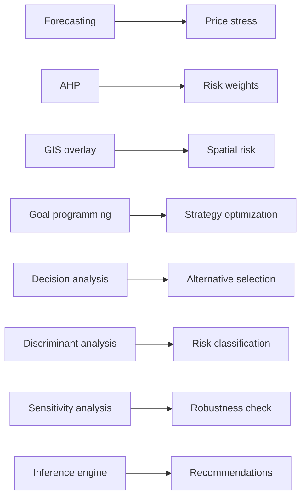

# Intelligent Decision Support System — Project Report

## Executive summary

This system supports Egyptian food-import decisions by combining **quantitative models** (forecasting, AHP, goal programming, discriminant analysis, GIS-style overlays, sensitivity analysis) with a **knowledge base** and **inference / explanation** layers. Primary data are **WFP** and optional **FAO/FAOSTAT-style** wheat prices, **bilingual (Arabic–English) news NLP** indices, **shipping** metrics (port-derived plus optional tracker CSV/API), **GDELT conflict** statistics, and **global port activity** filtered to Egypt and key supplier regions.

---

## Novelty: Arabic–English NLP conflict index vs price spikes

`src/nlp_conflict_index.py` scores headlines with **bilingual keyword density** (conflict / supply-chain lexicon) and a **light sentiment polarity** (calming vs escalatory phrasing). Headlines are aggregated monthly into **`nlp_conflict_index`** and **`news_sentiment_avg`**. The dashboard reports **Pearson correlation** between the conflict index and a **price spike proxy** (standardized absolute month-on-month change in blended wheat USD). This satisfies the P-02 novelty requirement without transformer-scale dependencies. Replace `news_headlines_bilingual.csv` with your own Arabic/English corpus for empirical validation.

---

## FAO and shipping data integration

* **FAO:** `src/fao_prices.py` reads either a simple `month, price_usd` file or FAOSTAT-style long tables (`Area`, `Item`, `Year`, `Value`, …). The blended series is **55% FAO / 45% WFP** when both exist (`merge_wfp_fao`).
* **Shipping:** `src/shipping_tracker.py` merges **port-derived** Egypt/Black Sea flow stress with an optional **`shipping_metrics.csv`** (congestion, delays). Environment variable **`SHIPPING_TRACKER_API_URL`** can point to a JSON shipping API if you have a vendor key.

---

## 1. Forecasting in decision support

Retail **wheat flour** prices (national average) are aggregated monthly from `wfp_food_prices_egy.csv`. The app uses a **moving-average baseline** and, when available, **exponential smoothing** (`statsmodels`) for the next-period level. Outputs include trend direction, an error proxy vs. rolling fit, and narrative early-warning text tied to volatility and price vs. moving average.

---

## 2. Goal programming for import strategy selection

A **weighted penalty** formulation (`src/goal_programming.py`) scores predefined strategies (maintain supplier, early buy, diversify, etc.) against goals such as disruption risk, cost pressure, reliability, stock coverage, route risk, and delay. The alternative with the **lowest weighted deviation** is recommended for display in the dashboard.

---

## 3. Decision making under certainty

When single-point utility scores are trusted, the model selects the alternative with the **maximum deterministic utility** (`decision_methods.deterministic_utility_best`).

---

## 4. Decision making under risk

With scenario probabilities, the app computes **expected utility** as  
\(\sum_s p(s)\, u(a,s)\)  
using adjustable sliders for Normal / Moderate / Severe / Critical disruption (`expected_utility`).

---

## 5. Decision making under uncertainty

When probabilities are discarded, the dashboard shows **maximax**, **maximin**, **Laplace**, **minimax regret**, and **Hurwicz** choices, plus the **regret matrix**, implemented in `uncertainty_criteria`.

---

## 6. Discriminant analysis for risk classification

Engineered monthly features feed **Linear Discriminant Analysis** when enough history exists. **Weak labels** collapse to **two classes**: **0** (Low + Moderate composite stress) and **1** (High + Critical), from the same averaged score rule as before (\(s < 55 \Rightarrow 0\), else \(1\)). This is for educational evaluation, not ground truth.

---

## 7. AHP for risk weight selection

Pairwise comparisons among six criteria yield **priority weights**, **consistency index**, and **consistency ratio**. Poor consistency triggers a warning; users may override with manual sliders.

---

## 8. GIS overlay analysis for spatial risk

Without geopandas/GDAL, `src/gis_analysis.py` implements **composite spatial risk** using Plotly: supplier markers, illustrative import routes, conflict-scatter proxies from GDELT aggregates, and a **heatmap-style contour** from weighted layers (conflict, port/logistics, supplier importance, route vulnerability).

---

## 9. Sensitivity analysis

Tornado-style panels and weight multipliers on the **Unified Risk** page show how shifting geopolitical, logistics, and price-stress emphasis moves the composite score.

---

## 10. Knowledge base and inference engine

Structured **IF–THEN** rules map indicator thresholds to **alerts** and **recommended actions**, with explicit **rule IDs** and **data-source attribution** (`knowledge_base.py`, `inference_engine.py`).

---

## 11. Explanation facility

Each alert can be expanded into **why / which driver / which rule / which data** using `explanation_engine.explain_alert` and methodology blurbs per page.

---

## Architecture diagrams

### Intelligent DSS architecture

### IDSS method integration

### Recommendation reasoning flow

---

## 12. Port, vessel, and route intelligence (offline demo)

Synthetic-but-realistic **ports**, **vessels**, and **conflict zones** live under `data/sample/` (generated from defaults). `src/port_intelligence.py`, `src/vessel_tracking.py`, `src/conflict_zones.py`, and `src/route_risk.py` implement scoring, detours, and **Plotly Scattergeo** maps without Mapbox tokens or paid AIS. The Executive Overview embeds a ministry-style panel; **GIS** adds a second map tab; **Port & Vessel Intelligence** is a full-screen console. Optional narrative uses `src/ollama_advisor.py` (`/api/generate`) with deterministic fallbacks via `src/alert_system.py` and `src/recommendations.py`.

---

## Reproducibility notes

- **First run** on the full port CSV may take on the order of **seconds to a few minutes** depending on hardware; the pipeline uses chunked reads.
- Use a Python environment with **pre-built wheels** for NumPy/Pandas (see `README.md`) to avoid local compilation issues.
